# [node-proxy-logger](https://www.npmjs.com/package/node-proxy-logger)

## description

this method is intended to display graphs call methods in the form of diagrams https://mermaid.js.org/
for your application

<details>
  <summary>Image example</summary>
	


</details>

<details>
  <summary>Mermaid gitgub render</summary>


</details>

```mermaid
graph TB
Start --> | 0.012 ms | initRequestMode
initRequestMode --> | 0.019 ms | initRequestHttp
initRequestHttp --> | 0.044 ms | initRequestType
initRequestType --> | 0.001 ms | initRequestQuery
initRequestQuery --> | 0.024 ms | initRequestAppWithUserAgent
initRequestAppWithUserAgent --> | 0.017 ms | initRequestAppWithHeaders
initRequestAppWithHeaders --> | 0.047 ms | initRequestApp
initRequestApp --> | 0.050 ms | initRequest
initRequest --> | 0.124 ms | initDeviceDetect
initDeviceDetect --> | 0.280 ms | result
InfoDetectDevice[ os <table style="width:100%" border=1><tbody><tr><td>name</td><td>Android</td></tr><tr><td>version</td><td>4.4.2</td></tr><tr><td>platform</td><td></td></tr><tr><td>family</td><td>Android</td></tr></tbody></table><br>client <table><tbody><tr><td>type</td><td>browser</td></tr><tr><td>name</td><td>Chrome Webview</td></tr><tr><td>version</td><td>30.0.0.0</td></tr><tr><td>engine</td><td>Blink</td></tr><tr><td>engine_version</td><td>30.0.0.0</td></tr><tr><td>family</td><td>Chrome</td></tr></tbody></table><br>device <table><tbody><tr><td>type</td><td>tablet</td></tr><tr><td>brand</td><td>Lenovo</td></tr><tr><td>model</td><td>IdeaTab A10-70</td></tr></tbody></table><br>has <table><tbody><tr><td>isFeaturePhone</td><td>false</td></tr><tr><td>isSmartphone</td><td>false</td></tr><tr><td>isPhablet</td><td>false</td></tr><tr><td>isPortableMediaPlayer</td><td>false</td></tr><tr><td>isWearable</td><td>false</td></tr><tr><td>isGlobalMobile</td><td>false</td></tr><tr><td>isTablet</td><td>true</td></tr><tr><td>isCar</td><td>false</td></tr><tr><td>isSmartDisplay</td><td>false</td></tr><tr><td>isPeripheral</td><td>false</td></tr><tr><td>isDesktop</td><td>false</td></tr><tr><td>isCamera</td><td>false</td></tr><tr><td>isTv</td><td>false</td></tr><tr><td>isSmartSpeaker</td><td>false</td></tr><tr><td>isConsole</td><td>false</td></tr><tr><td>isAndroid</td><td>true</td></tr><tr><td>isIOS</td><td>false</td></tr><tr><td>isYandexBrowser</td><td>false</td></tr><tr><td>isBot</td><td>false</td></tr><tr><td>isMobile</td><td>false</td></tr><tr><td>isIOSMobile</td><td>false</td></tr><tr><td>isIOSTablet</td><td>false</td></tr><tr><td>isAndroidTablet</td><td>true</td></tr></tbody></table> ] --> | device info | initDetectDevice
result --> | 0.068 ms | initType
initType --> | 0.064 ms | resultResponse
resultResponse --> TB[fa:fa-ban TB]
style TB fill:#ff3f3a                  
```

## usage

For constructor:

```js
import {proxyLogger} from "node-proxy-logger"

export default class ExampleController extends AbstractController {

  logs = [];

  constructor(options) {
    super(options)
    
    return proxyLogger(this, {
      regexExclude: /^(is|get|set|pushlog)/i,
      loopStart: 'Start',
      logMethod: 'pushLog'
    });
  }

  pushLog(message, data, group = 'graph') {
    this.logs.push({message, data, group})
  }
  
  index() {
    return 'hello world'
  }
}
```

For instance object:

```js
import {proxyLogger} from "node-proxy-logger"
const exampleController = new proxyLogger(new ExampleController, {
	
})

exampleController.index();
```

